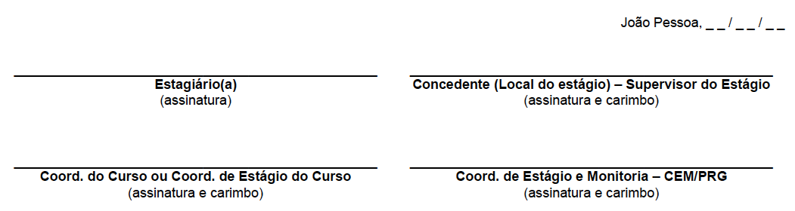

===  Procurando onde estagiar

O local onde você irá estagiar deverá ser uma escola de Ensino Básico conveniada
com a UFPB. Você pode ver a lista de instituições conveniadas com a UFPB
no arquivo disponibilizado no seguinte endereço:

* http://www.proplan.ufpb.br/proplan/contents/documentos/19-02-2016-convenios-vigentes.pdf

TIP: Observe que se você quer estagiar em uma escola estadual,
isto será possível,já que na lista de convênios está a
Secretaria de Educação do Estado:
_GOVERNO DO ESTADO DA PARAÍBA /SEE - Secretaria de Estado
da Educação da Paraíba.
Número do Convênio: 017/2016_

[WARNING]
========
Se o estágio for em uma escola municipal, tente identificar
se nas instituições conveniadas com a UFPB está a prefeitura
do Município em que está a escola.
========

===  Procurando um supervisor de estágio

Uma vez que você definiu a escola em que irá atuar, deverá
conversar com a direção para saber quem poderá ser seu
supervisor de estágio.

O supervisor será a pessoa com quem você discutirá seu planejamento,
que lhe acompanhará na sua atuação em sala de aula e que
preencherá sua ficha de avaliação ao final do estágio.

Seu supervisor poderá ser o(a) diretor(a), supervisor(a),
coordenador(a) pedagógico(a) da escola, ou um(a) professor(a)
que irá acompanhar você no uso das TIC na educação ou ensino
de computação, desde que tenha curso superior  concluído na área
de Educação (ex: Pedagogia ou alguma licenciatura) ou computação.

Tente definir com seu supervisor os tipos de atividade
compatíveis com o perfil de egresso em Licenciatura em Computação
que seriam interessantes e viáveis de se realizar na escola
em que você irá atuar.

=== Aproveitando sua experiência como professor

Se você já atua há mais de um ano como docente na Educação
Básica em uma escola conveniada e em atividades compatíveis com
o perfil do egresso de computação, pode pedir aproveitamento
de experiência e ser dispensado da disciplina de Estágio 2.
Para isso, preencha o formulário de aproveitamento de experiência e
envie no seu pedido de aproveitamento um relato de sua
experiência detalhando as atividades que já realizou, bem como
a documentação comprobatória do seu vínculo com a escola.

O formulário de aproveitamento de experiência pode ser baixado
através do seguinte endereço:

* http://www.prg.ufpb.br/?q=download/file/fid/785

Os dados referentes à disciplina serão os mesmos do PAE e TCE
comentados nas seções a seguir.

=== Preenchendo seu PAE (Plano de Atividades de Estágio)

O formulário do Plano de Atividades de Estágio da UFPB pode ser
baixado através do seguinte endereço:

* http://www.prg.ufpb.br/?q=download/file/fid/1052

image::images/pae_tce/pae_tce1.png[scaledwidth="95%", align="center"]

Na primeira parte do PAE, você deverá
preencher seu nome (campo 1.1), seu curso (1.2), ou seja, Licenciatura em Computação,
sua matrícula na UFPB (1.2.1), o período em que você está no curso (1.2.2),
seu endereço residencial (1.3), incluindo CEP (1.3.1), seu telefone residencial (1.4),
celular (1.5) e seu e-mail (1.6).

A seguir você irá preencher os dados referentes à instituição
em que irá estagiar.

image::images/pae_tce/pae_tce2.png[scaledwidth="95%", align="center"]

[IMPORTANT]
========
Se a escola for estadual ou municipal, os dados
Razão Social (2.1), CNPJ (2.2), Endereço (2.3) e CEP (2.4) serão os
da Secretaria de Educação do Estado ou os da prefeitura do
município, respectivamente.

Por exemplo, se você for estagiar em uma escola estadual,
preencherá esses campos da seguinte forma:

*2.1. Razão Social:* _GOVERNO DO ESTADO DA PARAÍBA /SEE -
Secretaria de Estado da Educação da Paraíba_ ou apenas _Secretaria de Estado da
Educação da Paraíba_

*2.2 CNPJ:* _08.778.250/0001-69_

*2.3 Endereço:* _Centro Administrativo Integrado, Bloco I, 6º Andar-
Jaguaribe, João Pessoa._

*2.4 CEP:* _58.015-020_
========

O endereço e CEP pode também ser obtido consultando o CNPJ no site da Receita Federal:

* http://www.receita.fazenda.gov.br/pessoajuridica/cnpj/cnpjreva/cnpjreva_solicitacao.asp

Nesta parte do formulário, além dos dados anteriormente descritos, você deverá
também preencher os seguintes campos:

* *2.5.	Telefone* – Telefone da escola em que está realizando
o estágio, e caso não tenha, colocar o telefone da secretaria
municipal ou estadual da educação.

* *2.6.	Setor da empresa onde será desenvolvido o estágio* – Nome da escola
onde realizará o estágio

* *2.7.	Nome legível do Supervisor de estágio na empresa/instituição* – Esse
supervisor poderá ser o diretor, supervisor, coordenador pedagógico da escola,
ou um professor que você irá acompanhar no uso das TIC na educação, desde
que tenha curso superior concluído na área de Educação ou computação.

* *2.7.1.	Formação profissional do supervisor* –Área específica de formação
do supervisor e que seja relacionada ao curso de Licenciatura em Computação.
Ex: Graduação em Pedagogia, Licenciatura em Matemática, Ciência da Computação,
etc.

* *2.7.2.	E-mail* – E-mail do supervisor do seu estágio.

A seguir você preencherá alguns dados sobre a disciplina e sobre seu estágio.

image::images/pae_tce/pae_tce3.png[scaledwidth="95%", align="center"]

Algumas dessas informações estão apresentadas a seguir:

* *3.1.	Nome da disciplina* – _Estágio Curricular Supervisionado II (Estágio Curric. Sup. II)_

* *3.1.1.	Código da disciplina* – _5102024_

* *3.1.2.	Carga horária* – _75 horas_

* *3.1.3.	Créditos* – _05_

* *3.2.	Início do Estágio* – _01/02/2016_

* *3.3.	Término do Estágio* – _15/06/2016_

* *3.4.	Horário* – __ _hs às _ _hs e/ou Variável._ Obs: Se quiser definir algum
horário fixo, preste atenção para que sejam ao menos
5 horas semanais e no máximo 30 horas semanais

* *3.5.	Carga horária semanal* – _5h_

* *3.6.	Professor orientador do estágio* – _Ayla Débora Dantas de Souza Rebouças_

* *5.6.3.	Matricula SIAPE* – 1694584-7

* *2.6.1.	Formação Profissional* – _Bacharelado, Mestrado e Doutorado em Ciência da Computação_

* *2.6.2. E-mail* - _ayla@dce.ufpb.br_

Na parte 4 do formulário você deverá colocar a lista de atividades que irá
desenvolver no seu estágio e que devem ser compatíveis com
o perfil de egresso do curso de Licenciatura em Computação.

[TIP]
====

Antes de levar o documento para ser assinado pelos responsáveis
da escola, é importante discutir no
ambiente virtual da disciplina as atividades que você irá colocar
no seu plano de atividades, para garantir que são compatíveis
com o perfil de egresso do curso de Licenciatura em Computação
e obter feedback sobre elas e sobre o preenchimento dos documentos
em geral.

====

Alguns exemplos de atividades com que se pode prencher o formulário
estão a seguir:

* *4.1.*	Reflexões sobre o ensino de informática/computação no Ensino Infantil e/ou Fundamental e/ou Médio;
* *4.2.*	Reflexões sobre o uso das TICs para apoiar o ensino de diversas disciplinas;
* *4.3.*	Observação de sala de aula;
* *4.4.*	Elaboração do projeto de intervenção (planos de aula e projeto pedagógico multidisciplinar);
* *4.5.*	Atividade de intervenção em sala de aula;
* *4.6.*	Produção de relatório baseado nas atividades desenvolvidas no decorrer do estágio.

Depois dessa parte está o local das assinaturas, onde deverá estar a sua
assinatura no campo *Estagiário* e a assinatura de um representante da
*Unidade Concedente* (escola), bem como o seu carimbo.  Não precisa colocar a data, após
“João Pessoa”, pois será preenchida pelo setor de estágios da
UFPB ao receber a documentação.

image::images/pae_tce/pae_tce6.png[scaledwidth="95%", align="center"]

=== Preenchendo seu TCE (Termo de Compromisso de Estágio)

O formulário do Termo de Compromisso de Estágio da UFPB pode ser
baixado através do seguinte endereço:

* http://www.prg.ufpb.br/?q=download/file/fid/1051

Para preencher o TCE você utilizará vários dos dados que já
preencheu no PAE. No início, você deverá preencher a data de
início do estágio, que deve ser a data de início do período:

* "_Ao *1o.* dia do mês de *fevereiro* de 20 *16*, na cidade..._"

image::images/pae_tce/pae_tce7.png[scaledwidth="95%", align="center"]

Depois, você preencherá os dados referentes à escola:

* *2.1.	Razão Social* – Dados da secretaria do município (se for em escola municipal) ou da Secretaria de Educação do Estado (se escola Estadual) ou da escola conveniada (Veja relação dos convênios no site da UFPB: http://www.prg.ufpb.br/?q=view-convenios-estagio).

* *2.2.	CNPJ* – CNPJ da secretaria do município ou do estado  ou da escola conveniada.

* *2.3.	Endereço* – Dados da secretaria do município ou do estado ou da escola, caso seja diretamente conveniada.

* *2.4.	CEP* – CEP da secretaria do município ou do estado ou da escola, caso seja diretamente conveniada.

* *2.5.	Telefone* – Telefone da escola ou o da Secretaria de Educação, caso a
escola não tenha um número de telefone para contato.

* *2.6.	Setor da empresa onde será realizado o estágio* – Nome da escola onde realizará o estágio

* *2.7.	Supervisor do estágio* – Nome do seu supervisor.

* *2.7.1.	Formação profissional do supervisor* – Área específica de formação, considerando que deve ter curso
superior em educação ou computação.

* *2.7.2.	E-mail* – E-mail do supervisor do seu estágio.

image::images/pae_tce/pae_tce8.png[scaledwidth="95%", align="center"]

A seguir, na Seção 3 do formulário, você preencherá os seus dados: seu
nome (3.1), seu curso, no caso Licenciatura em Computação (3.2), sua matrícula (3.3),
o período do curso em que você está (3.4), seu
endereço residencial (3.5), CEP (3.6), telefone residencial (3.7), celular (3.8),
e seu e-mail (3.9).

image::images/pae_tce/pae_tce9.png[scaledwidth="95%", align="center"]

Na Seção 4 do TCE você deverá preencher os dados referentes ao convênio
da sua escola com a UFPB:

* *4.1.	Número* – Número do convênio da secretaria do município ou do estado
ou da escola (Veja relação dos convênios e seus dados no site da
UFPB: http://www.prg.ufpb.br/?q=view-convenios-estagio).

* *4.2.	Início da vigência* – Data de início da vigência do convenio da secretaria do município, do estado, ou da escola.

* *4.3.	Término da vigência* – Data da vigência do convênio com a secretaria ou com a escola,
caso haja convênio diretamente entre a escola e a UFPB.

image::images/pae_tce/pae_tce10.png[scaledwidth="95%", align="center"]

[TIP]
========
Se sua escola é estadual, você deverá utilizar como número do convênio (4.1) o seguinte:
_017/2016_. O Início da Vigência (4.2) será _12/02/2016_. O Término da Vigência (4.3)
deverá ser preenchida com a data _12/02/2021_.
========

A Seção 5 contém as informações relativas ao estágio, como horário e dados
da disciplina e deverá ser preenchida com os mesmos dados utilizados no
preenchimento da Seção 3 do PAE.

O campo *e)*, referente à bolsa-auxílio e vale transporte não deve ser preenchido.

A última parte do TCE se refere às assinaturas. Você irá assinar no campo
*Estagiário* e deverá obter a assinatura e carimbo do(a) diretor(a) da
escola em que irá atuar ou de seu(sua) supervisor(a), que deverá ficar no campo
*Concedente (Local do estágio) – Supervisor do Estágio*. As
demais assinaturas serão recolhidas pela equipe da disciplina
de Estágio Curricular Supervisionado II quando os documentos
chegarem até a coordenação do curso. A data será preenchida pelo setor de
estágios da UFPB.

=== Outras informações importantes sobre o preenchimento

1.	Os formulários devem ser preenchidos com caneta AZUL ou
PRETA, com letra LEGÍVEL.
2.	Os documentos NÃO DEVEM CONTER RASURAS.
3.	Para o caso de ESCOLAS PARTICULARES, verificar se as
mesmas possuem convênio com a UFPB.
4.	Os documentos deverão ser preenchidos em uma via.

=== Atividade: Preenchimento do PAE e TCE

Depois de definir a escola em que irá atuar, de definir quem será seu
supervisor de estágio, e de acompanhar as instruções deste
capítulo, preencha os ducumentos PAE (Plano de Atividades)
e TCE (Termo de Compromisso) referentes ao estágio obrigatório
e que estão disponibilizados na sala de aula da disciplina
no  Moodle ou no site da UFPB:
http://www.prg.ufpb.br/?q=view-form-estagio

Os documentos devem ser digitalizados e enviados como atividade e devem ser
também entregues nos polos para serem encaminhados à coordenação do curso.
